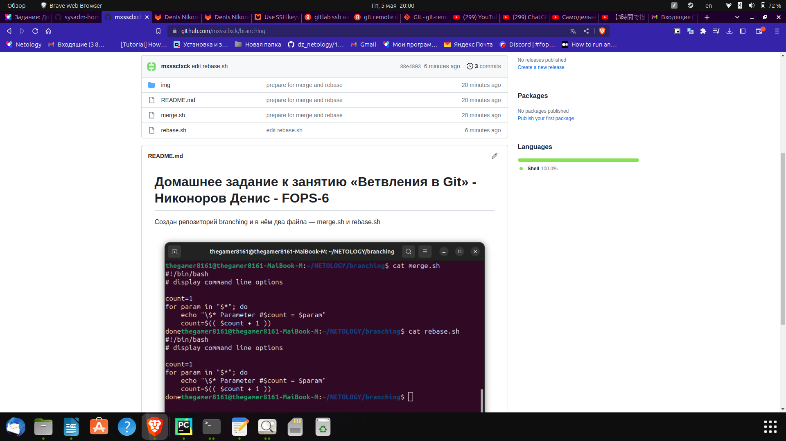
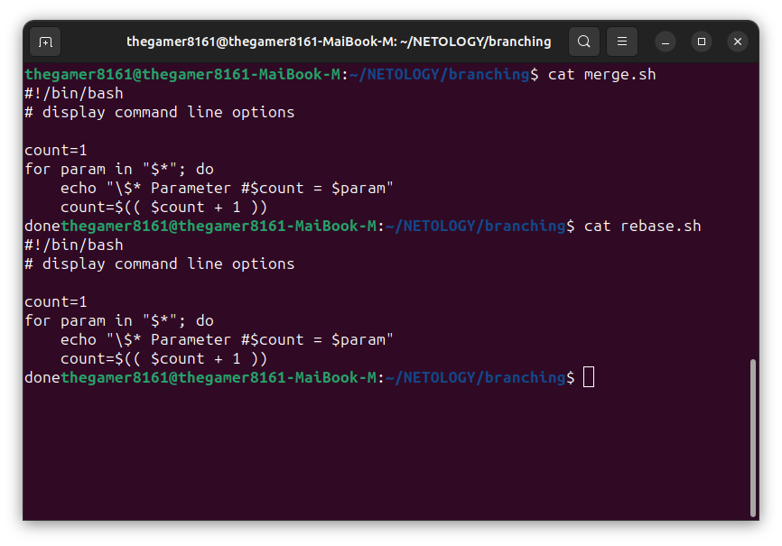
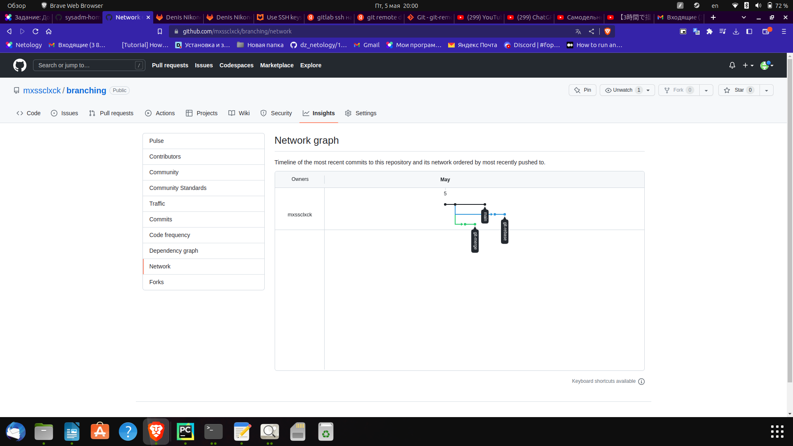
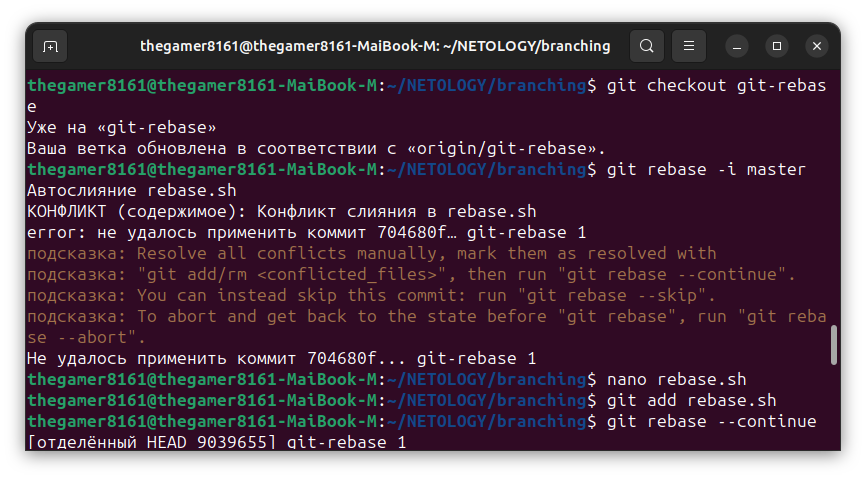
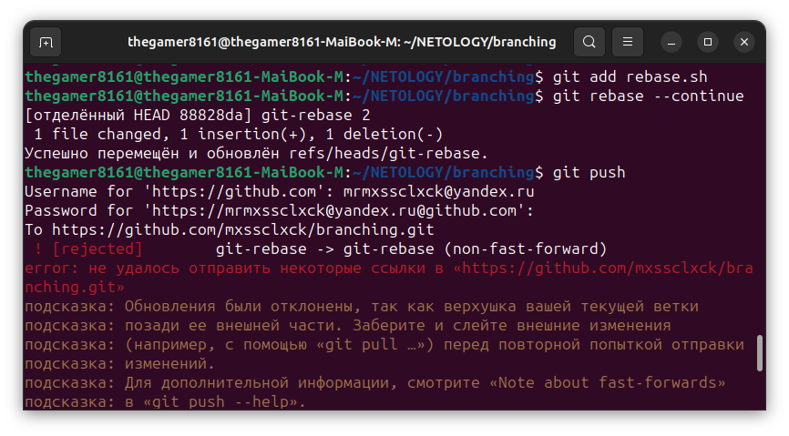
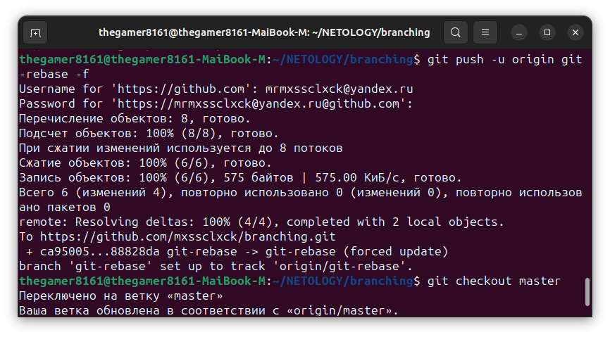
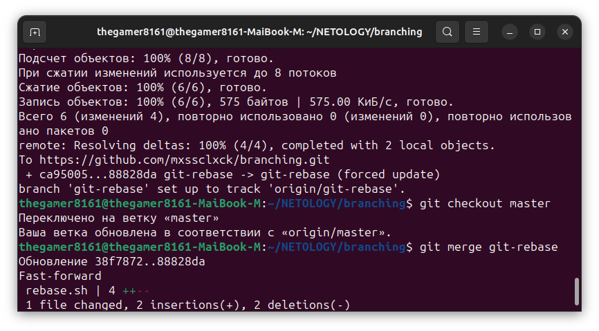

# Домашнее задание к занятию «Ветвления в Git» Никоноров Денис - FOPS-6

Создан репозиторий branching и 2 файла merge.sh и rebase.sh

Создан коммит с описанием prepare for merge and rebase

Создана ветка git-merge. И выполнены 2 изменения merge.sh с 2 коммитами ('merge: @ insted *' и 'merge: use shift')
Создана ветка git-rebase и сделаны 2 коммита 

Полученный промежуточный итог

Подготовка мержа git-rebase. Переключаемся на ветку git-rebase. Выполняем  *git rebase -i master*

Появились конфликты и необходимо их устранить

Делаем *git push*

Мержим ветку git-rebase в master

